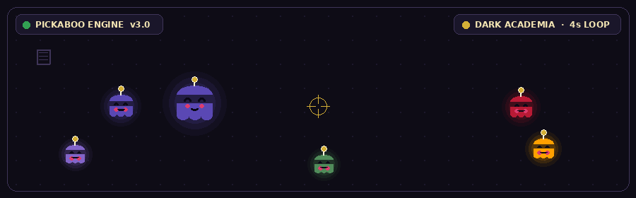

<div align="center">

<!-- PickaBoo Banner — click to open the live interactive game -->
<a href="https://TeacherEvan.github.io/TeacherEvan/" target="_blank" title="Click to play the live PickaBoo cursor game!">
  
</a>

<br/><br/>

# 🤪🀄️🇿🇦🇿🇦🇿🇦🀄️👾🤌Ewaldt Botha🤌👾🀄️🇿🇦🇿🇦🇿🇦🀄️🤪
### Full-Stack creationist · Creative Technologist · Educator - Penguin

<p>
  <em>I build things that scale, things that teach, and things that <strong>explode.</strong></em>
</p>

<!-- Status Badges -->
<p>
  
  
  
  
</p>

<p>
  <a href="https://TeacherEvan.github.io/TeacherEvan/">
    
  </a>
</p>

</div>

---

### 👾 About Me

```typescript
const PickaBoo: Creater = {
  handle:   "PickaBOO",
  role:     "Full-Stack Builder & Creative Technologist",
  pronouns: "he/him",

  languages: ["TypeScript", "JavaScript", "Python", "Go", ".NET"],

  frontend:  ["React", "Next.js", "TailwindCSS", "Three.js", "HTML5 Canvas", "WebGL"],
  backend:   ["Node.js", "FastAPI", "Django", "Flask", "GraphQL", "gRPC"],
  databases: ["PostgreSQL", "MySQL", "MongoDB", "Redis"],
  cloud:     ["AWS", "GCP", "Azure", "Docker", "Kubernetes", "GitHub Actions"],

  currentlyBuilding: "Real-time interactive simulations & distributed backend systems",
  openTo:            "Ideas",

  easteregg: "The sprite in the banner chases your cursor and self-destructs in 4s 💥"
};
```

---

### 🛠️ Stack

<div align="center">

**Languages**
<p>

</p>

**Frontend**
<p>

</p>

**Backend & APIs**
<p>

</p>

**Databases & Infrastructure**
<p>

</p>

</div>

---

### 📊 Activity

<div align="center">
<table>
<tr>
<td width="50%">

</td>
<td width="50%">

</td>
</tr>
<tr>
<td colspan="2">

</td>
</tr>
</table>
</div>

---

### 🚀 Featured Work

| Project | What it does | Stack | Links |
| :--- | :--- | :--- | :--- |
| 👾 **PickaBoo Engine** | Cursor-tracking sprite swarm — touch the sprite, 4s countdown, colorful firework detonation | `Canvas` `JS` `Web Audio` | [▶ Live Game](https://TeacherEvan.github.io/TeacherEvan/) · [Source](public/index.html) |
| ⚡ **Distributed Core** | Event-driven microservices: sub-ms cache, automated failover, K8s orchestration | `Go` `FastAPI` `Redis` `K8s` | [Docs](docs/plans/) |
| 🎓 **TeacherEvan Hub** | Interactive teaching platform with live coding playgrounds & progress tracking | `Next.js` `PostgreSQL` `AWS` | [Repo](https://github.com/TeacherEvan) |

---

### 📬 Connect

<div align="center">

<a href="https://github.com/TeacherEvan">
  
</a>
<a href="https://linkedin.com">
  
</a>
<a href="https://twitter.com">
  
</a>

<br/><br/>
<sub>⚡ <strong>PickaBoo Engine v3.0</strong> — Dark Academia Edition · Hand-crafted by <a href="https://github.com/TeacherEvan">TeacherEvan</a></sub>

</div>
